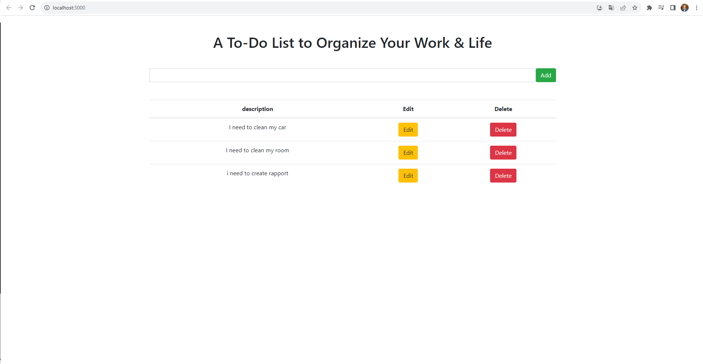

# To-Do-List
J'ai développé une application web "To-Do" avec Postgres, Express, React et Node. 
Cet outil efficace pour la gestion du temps et des tâches permet aux utilisateurs d'organiser facilement leurs tâches.
L'application simplifie la gestion des tâches, permettant aux utilisateurs de créer, prioriser et gérer leurs listes de tâches sans effort.

[English]

I have developed a web application called "To-Do" using Postgres, Express, React, and Node. 
This efficient tool for time and task management allows users to easily organize their tasks. 
The application simplifies task management, enabling users to create, prioritize, and manage their to-do lists effortlessly.

